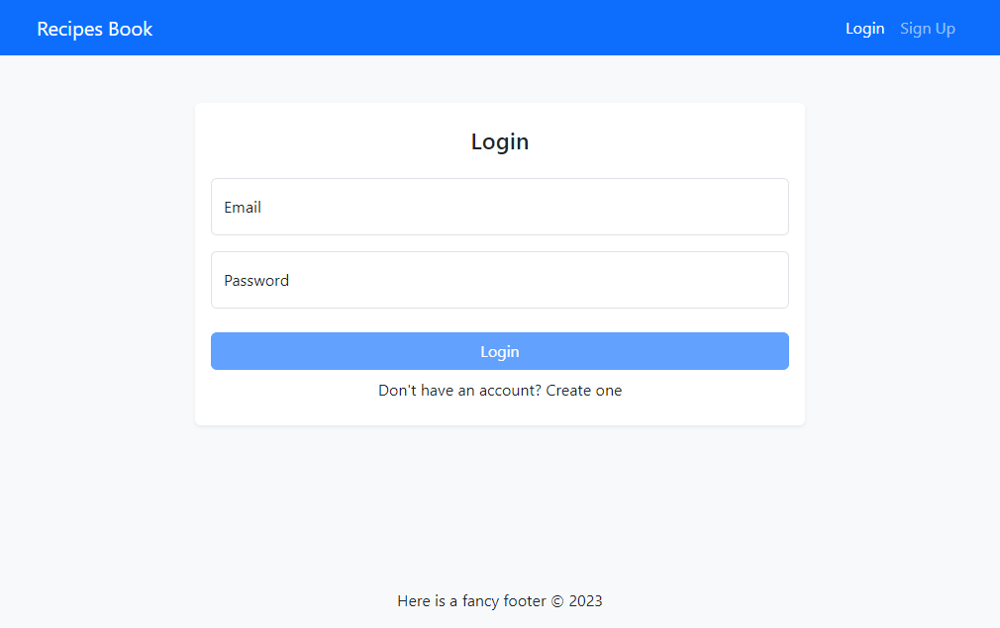
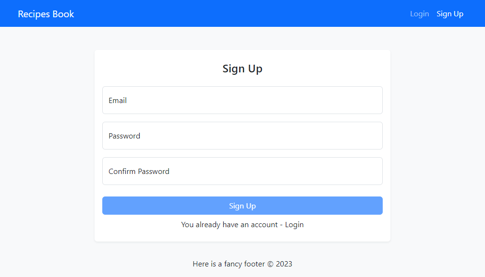
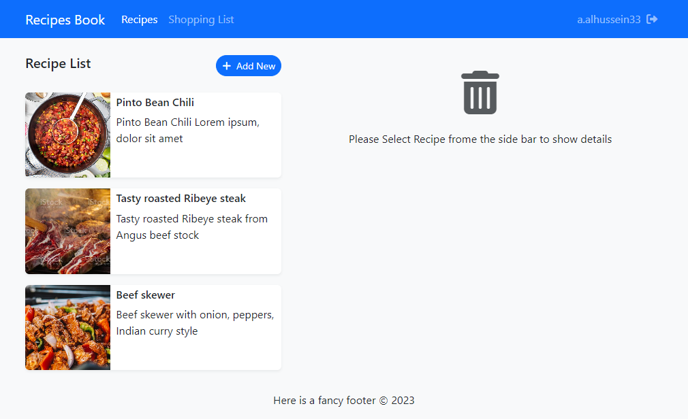
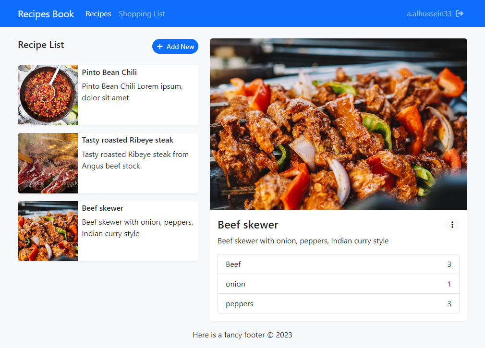
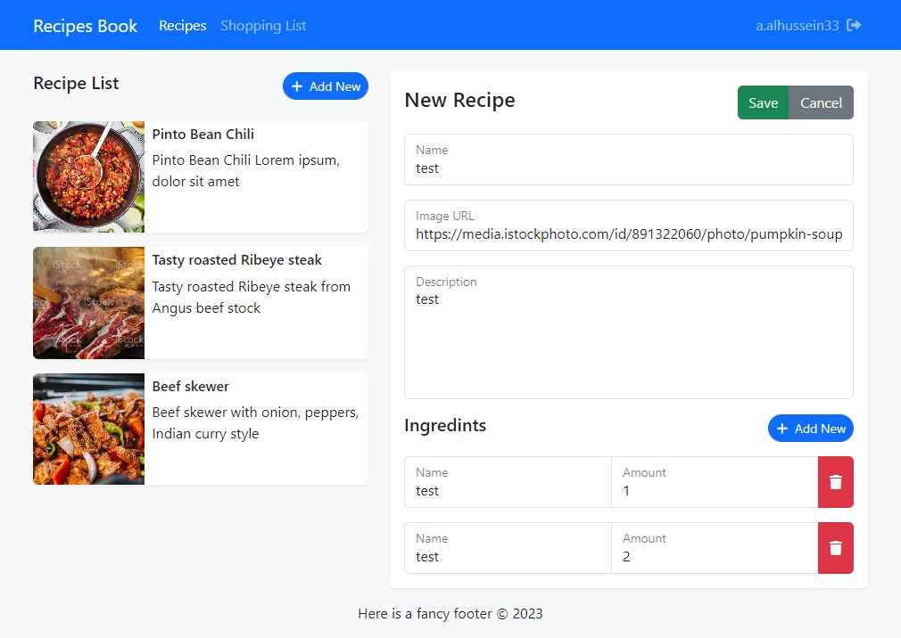
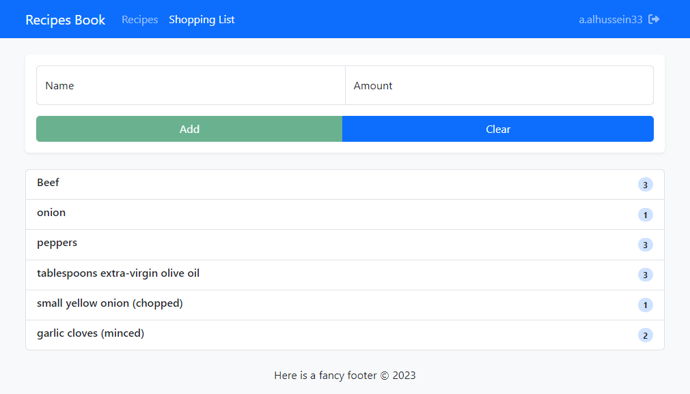

# Recipes Book
This is a Recipes Book Application that I created with Angular, Bootstrap, and Firebase. As the final project in [Angular - The Complete Guide](https://www.udemy.com/course/the-complete-guide-to-angular-2/) Course by [Maximilian Schwarzmüller](https://academind.com/), That I've just completed.

## Live Previwe
[Github Pages](https://alialhussein.ml/recipes-book)

## Credits
* [Angular - The Complete Guide Course](https://www.udemy.com/course/the-complete-guide-to-angular-2/)